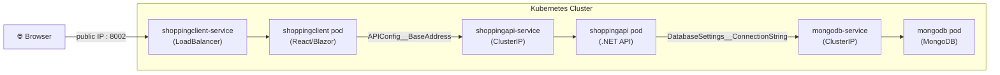
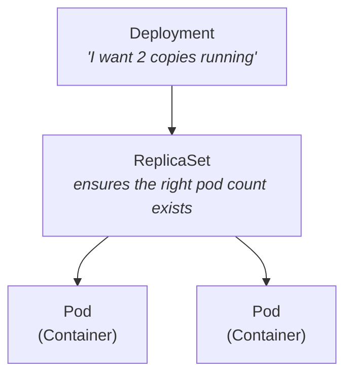
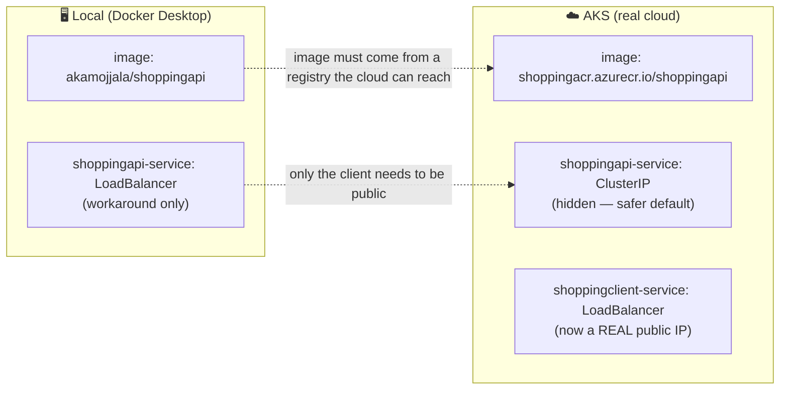
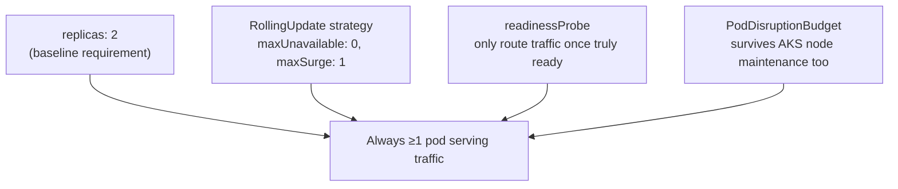
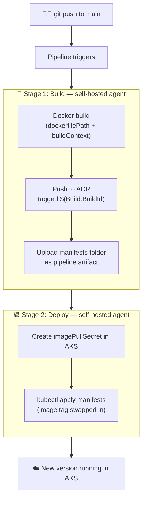

# Shopping App — Docker to AKS Journey

A reference guide covering everything done so far: containerizing **Shopping.Client** (frontend) and **Shopping.API** (.NET backend) with **MongoDB**, running them locally with Docker Compose, deploying to a local Kubernetes cluster, pushing images to Docker Hub and Azure Container Registry (ACR), and finally running the whole stack on Azure Kubernetes Service (AKS).

[](https://dev.azure.com/achuthakrrish/shopping/_build/latest?definitionId=33&branchName=main) [](https://dev.azure.com/achuthakrrish/shopping/_build/latest?definitionId=34&branchName=main)

---

## Table of Contents

1. [Architecture Overview](#1-architecture-overview)
2. [Part 1 — Dockerizing the Apps](#2-part-1--dockerizing-the-apps)
3. [Part 2 — Docker Compose](#3-part-2--docker-compose)
4. [Part 3 — Local Kubernetes (Docker Desktop)](#4-part-3--local-kubernetes-docker-desktop)
5. [Part 4 — Pushing Images to a Registry](#5-part-4--pushing-images-to-a-registry)
6. [Part 5 — Azure Kubernetes Service (AKS)](#6-part-5--azure-kubernetes-service-aks)
7. [Part 6 — Zero Downtime & Autoscaling](#7-part-6--zero-downtime--autoscaling)
8. [Part 7 — Cost Management](#8-part-7--cost-management)
9. [Part 8 — CI/CD with Azure DevOps Pipelines](#9-part-8--cicd-with-azure-devops-pipelines)
10. [Command Cheat Sheet](#10-command-cheat-sheet)
11. [Glossary](#11-glossary)
12. [Troubleshooting Log](#12-troubleshooting-log-real-issues-we-hit)

---

## 1. Architecture Overview



**Why the Client is public but the API and Mongo aren't:** only the Client is meant to face users directly. The API only needs to be reached by the Client, and the database should never be reachable from outside the cluster at all — smaller attack surface, safer default.

---

## 2. Part 1 — Dockerizing the Apps

### Key concepts

| Term | Meaning |
|---|---|
| **Image** | A packaged snapshot of your app + everything it needs to run (like a blueprint). |
| **Container** | A running instance of an image (like a house built from the blueprint). |
| **Dockerfile** | A recipe describing how to build an image, step by step. |
| **Registry** | A place images are stored/shared (Docker Hub, ACR, etc.). |

### Building an image

```bash
docker build -t <imagename>:<tag> .
```

- `-t` tags (names) the image.
- The trailing `.` is the **build context** — the folder Docker uses to find the Dockerfile and any files it `COPY`s in. Forgetting this is the #1 cause of `Dockerfile: no such file or directory` errors.
- If your Dockerfile isn't in the current folder, point to it directly:

```bash
docker build -t shoppingapi:latest -f Shopping.API/Dockerfile .
```

> Note the context (`.`) stays at the **solution root**, not the project subfolder — Visual Studio–generated Dockerfiles expect to `COPY` from multiple project folders relative to the solution.

### Running a container manually

```bash
docker run -d --name shoppingmongo -p 27017:27017 mongo
```

- `-d` = detached (background)
- `--name` = a friendly name instead of a random one
- `-p host:container` = maps a port on your machine to a port inside the container

### Tagging & pushing to a registry

```bash
docker tag <local-image>:<tag> <registry>/<image>:<tag>
docker push <registry>/<image>:<tag>
```

`docker push` isn't Docker Hub–specific — whatever hostname prefixes the tag decides where it goes (Docker Hub if no prefix, `shoppingacr.azurecr.io/...` for ACR, etc.).

### Useful inspection commands

```bash
docker images       # lists local image repositories (not containers)
docker ps            # lists RUNNING containers only
docker ps -a         # lists ALL containers, running or stopped
```

---

## 3. Part 2 — Docker Compose

Docker Compose runs multiple containers together as one stack, defined declaratively in YAML instead of long `docker run` commands.

```bash
docker compose -f docker-compose.yml -f docker-compose.override.yml up -d
docker compose up -d --build     # force rebuild from Dockerfiles
```

### What the two files do

- **`docker-compose.yml`** — the base file, usually holds `image:` + `build:` info (what to build/pull).
- **`docker-compose.override.yml`** — dev-specific overrides: environment variables, ports, volumes. Compose merges both automatically.

### The #1 gotcha we hit: port mismatches

```yaml
environment:
  - ASPNETCORE_HTTP_PORTS=8000   # tells Kestrel to listen on 8000 INSIDE the container
ports:
  - "8000:80"                    # ❌ wrong — maps host 8000 to container port 80, but nothing listens on 80
```

**Fix** — host and container ports must match what the app is actually listening on:

```yaml
ports:
  - "8000:8000"                  # ✅ correct
```

---

## 4. Part 3 — Local Kubernetes (Docker Desktop)

### Core building blocks



| Object | Purpose |
|---|---|
| **Pod** | The smallest deployable unit — one or more containers sharing network/storage. |
| **Deployment** | Manages Pods for you: desired replica count, self-healing, rolling updates. |
| **ReplicaSet** | Created automatically by a Deployment; keeps the actual pod count matching the desired count. |
| **Service** | A stable network address in front of a changing set of Pods (Pod IPs change on every restart). |
| **ConfigMap** | Non-sensitive config (key-value pairs) kept separate from the image/Pod spec. |
| **Secret** | Same idea as ConfigMap, but for sensitive data (base64-encoded, tighter access control). |

### Service types — who can reach it?

| Type | Reachable from | When to use |
|---|---|---|
| `ClusterIP` (default) | Only other Pods inside the cluster | Databases, internal APIs — the safe default |
| `NodePort` | The node's own IP on a high port (30000–32767) | Quick local testing |
| `LoadBalancer` | The public internet (on a real cloud) | User-facing services, e.g. the frontend |

### Everyday kubectl commands

```bash
kubectl get nodes                       # cluster's machines
kubectl get pods                        # running workloads
kubectl get pods -A                     # across ALL namespaces
kubectl get pods --show-labels          # see labels (used for Service selectors)
kubectl get svc                         # Services and their ports
kubectl get deployments
kubectl get rs                          # ReplicaSets
kubectl get endpoints <service-name>    # confirms a Service actually has a healthy Pod behind it

kubectl apply -f <file>.yaml            # create/update from a manifest
kubectl apply -f .                      # apply every YAML file in the folder

kubectl logs <pod-name>                 # see container output
kubectl logs <pod-name> --previous      # logs from BEFORE a crash/restart
kubectl exec -it <pod-name> -- sh       # open a shell inside a pod
kubectl describe pod <pod-name>         # detailed status, events, restart reasons

kubectl delete pod <pod-name>           # Deployment auto-recreates it

kubectl port-forward svc/<svc-name> <local-port>:<svc-port>   # tunnel to your machine

kubectl config get-contexts             # list known clusters
kubectl config current-context          # which cluster kubectl is pointed at
kubectl config use-context <name>       # switch clusters
```

### Quick object creation (imperative — for learning/testing only)

```bash
kubectl run swn-nginx --image=nginx
kubectl expose pod swn-nginx --port=80 --type=NodePort
kubectl create deployment nginx-depl --image=nginx
```

> Real apps use YAML manifests (`kubectl apply -f`) instead — imperative commands don't leave a reusable, version-controlled record of what you built.

### Dashboard UI (Headlamp)

The classic Kubernetes Dashboard is now archived/unmaintained. **Headlamp** is the actively maintained alternative:

```bash
helm repo add headlamp https://kubernetes-sigs.github.io/headlamp/
helm install my-headlamp headlamp/headlamp --namespace kube-system

kubectl -n kube-system create serviceaccount headlamp-admin
kubectl create clusterrolebinding headlamp-admin --serviceaccount=kube-system:headlamp-admin --clusterrole=cluster-admin
kubectl create token headlamp-admin -n kube-system

kubectl port-forward -n kube-system service/my-headlamp 8080:80
# open http://localhost:8080 and paste the token
```

---

## 5. Part 4 — Pushing Images to a Registry

### Docker Hub

```bash
docker tag shoppingapi:latest akamojjala/shoppingapi:latest
docker push akamojjala/shoppingapi:latest
```

### Azure Container Registry (ACR)

```bash
# one-time setup
az provider register --namespace Microsoft.ContainerRegistry
az acr create --name shoppingacr --resource-group myResourceGroup --location WestEurope --sku Basic

# login, then push (same docker push, different destination)
az acr login --name shoppingacr
docker tag shoppingapi:latest shoppingacr.azurecr.io/shoppingapi:latest
docker push shoppingacr.azurecr.io/shoppingapi:latest

# verify
az acr repository list --name shoppingacr --output table
```

### Alternative: build directly in the cloud (no local Docker needed)

```bash
az acr build --registry shoppingacr --image shoppingapi:latest --file Shopping.API/Dockerfile .
```

This uploads your source, builds inside Azure, and pushes automatically — build + push combined in one step.

---

## 6. Part 5 — Azure Kubernetes Service (AKS)

### What changes going from local → AKS



| Change | Why |
|---|---|
| `image:` → `shoppingacr.azurecr.io/...` | Your laptop's local image cache doesn't exist in Azure's cloud — the cluster needs a real, reachable registry address. |
| `shoppingapi-service` → back to `ClusterIP` | On the local cluster, `LoadBalancer` was a workaround for Docker Desktop's networking. On real AKS, `LoadBalancer` genuinely creates a public IP — so we only keep it on the Client (the front door), and hide the API again. |
| `shoppingclient-service` stays `LoadBalancer` | This one *should* be public — it's the app's front door. |

### Creating the cluster

```bash
az provider register --namespace Microsoft.ContainerService

az aks create \
  --resource-group myResourceGroup \
  --name shoppingaks \
  --tier free \
  --node-count 1 \
  --generate-ssh-keys \
  --attach-acr shoppingacr
```

- `--tier free` — no charge for the control plane (this is also the default if omitted).
- `--attach-acr` — grants the cluster's own Azure identity permission to pull images from that ACR automatically, no manual credentials needed.
- `--generate-ssh-keys` — required for the underlying node VMs; you won't need to actually use them.

### Connecting kubectl to AKS

```bash
az aks get-credentials --resource-group myResourceGroup --name shoppingaks
kubectl config current-context     # confirm you're pointed at AKS, not Docker Desktop
```

`kubectl` only ever talks to whatever's in your local kubeconfig file — this command fetches AKS's connection details from Azure and merges them in as a new context.

### Image pull authentication — two methods (only need one)

**Method A — Managed Identity (`--attach-acr`)**: already covers this automatically once the cluster is created with that flag. No YAML changes needed.

**Method B — Kubernetes Secret** (portable, works on any cluster/registry):

```bash
az acr credential show --name shoppingacr   # get username/password

kubectl create secret docker-registry acr-secret \
  --docker-server=shoppingacr.azurecr.io \
  --docker-username=<username> \
  --docker-password=<password>
```

Then reference it in the Deployment's **Pod spec** (not inside the container block):

```yaml
    spec:
      containers:
        - name: shoppingapi
          image: shoppingacr.azurecr.io/shoppingapi:v1
          # ...
      imagePullSecrets:
        - name: acr-secret
```

### Getting a real domain name (free)

```yaml
metadata:
  name: shoppingclient-service
  annotations:
    service.beta.kubernetes.io/azure-dns-label-name: shoppingclient-akamojjala
```

Gives you `shoppingclient-akamojjala.<region>.cloudapp.azure.com` automatically — no owned domain required.

---

## 7. Part 6 — Zero Downtime & Autoscaling

### Zero-downtime deployments — 4 pieces working together



```yaml
spec:
  replicas: 2
  strategy:
    type: RollingUpdate
    rollingUpdate:
      maxUnavailable: 0    # never drop below desired count during an update
      maxSurge: 1          # create the new pod BEFORE killing the old one
  template:
    spec:
      containers:
        - name: shoppingapi
          readinessProbe:
            httpGet:
              path: /openapi/v1.json
              port: 8000
            initialDelaySeconds: 5
            periodSeconds: 5
```

```yaml
apiVersion: policy/v1
kind: PodDisruptionBudget
metadata:
  name: shoppingapi-pdb
spec:
  minAvailable: 1
  selector:
    matchLabels:
      app: shoppingapi
```

- **Replicas = 1 will always cause a gap** — there's no second pod to take over while the first restarts.
- **Readiness probe** is the most-missed piece: without it, Kubernetes assumes a container is ready the instant it *starts*, even if the app inside hasn't finished connecting to the database yet.
- **PodDisruptionBudget** protects against a *different* disruption than app updates — AKS's own node upgrades/maintenance, which can evict pods without your Deployment even changing.

### Autoscaling (HPA)

```yaml
apiVersion: autoscaling/v2
kind: HorizontalPodAutoscaler
metadata:
  name: shoppingapi-hpa
spec:
  scaleTargetRef:
    apiVersion: apps/v1
    kind: Deployment
    name: shoppingapi-depl
  minReplicas: 1
  maxReplicas: 5
  metrics:
    - type: Resource
      resource:
        name: cpu
        target:
          type: Utilization
          averageUtilization: 70
```

Watches CPU as a % of the Deployment's `requests.cpu`, adding/removing pods to keep it near the target. Requires `metrics-server` (AKS has this by default).

```bash
kubectl get hpa
kubectl top nodes    # per-node CPU/memory usage
kubectl top pods     # per-pod CPU/memory usage
```

---

## 8. Part 7 — Cost Management

AKS on a **Pay-As-You-Go** subscription bills for node VMs by the hour, whether or not you're actively using them. The control plane (`--tier free`) is free; the node(s), Load Balancer, and public IP are not.

```bash
# stop the cluster (deallocates node VMs — stops billing for compute)
az aks stop --name shoppingaks --resource-group myResourceGroup

# resume later — same config, nothing lost
az aks start --name shoppingaks --resource-group myResourceGroup

# check what VM size your nodes are running
az aks show --resource-group myResourceGroup --name shoppingaks --query agentPoolProfiles[0].vmSize --output tsv

# check spend
az consumption usage list --start-date 2026-07-01 --end-date 2026-07-31 --output table

# nuclear option — delete EVERYTHING (AKS, ACR, LB, IP) in one shot
az group delete --name myResourceGroup --yes --no-wait
```

**Habit to build:** `az aks stop` at the end of every session, `az aks start` at the beginning of the next. Also set a budget alert in Azure Portal → Cost Management + Billing → Budgets.

---

## 9. Part 8 — CI/CD with Azure DevOps Pipelines

Two pipelines — `shoppingApi-pipeline` and `shoppingClient-Pipeline` — one per app. Each triggers on every push to `main`, builds a Docker image, pushes it to ACR, and deploys it straight to AKS.



### Why a self-hosted agent

New Azure DevOps organizations no longer get free Microsoft-hosted parallel jobs automatically (Microsoft restricted this after crypto-mining abuse of the free tier). You'll likely hit:

```
##[error]No hosted parallelism has been purchased or granted.
```

Two ways out: request the free grant at [aka.ms/azpipelines-parallelism-request](https://aka.ms/azpipelines-parallelism-request) (a manual review, usually a few business days), or run your own **self-hosted agent** — free, works immediately, since it just uses your own machine.

### Setting up a self-hosted agent

1. Azure DevOps → Project Settings → Agent Pools → **Default** pool → New Agent
2. Download the package it gives you, then register and start it:

```powershell
cd C:\agents
.\config.cmd     # one-time registration — links this machine to the pool
.\run.cmd        # starts listening for jobs — keep this terminal open while pipelines run
```

Docker Desktop must also be running on this machine, since the agent builds images using your local Docker installation, not a cloud VM.

### Build stage — the same build-context bug, now inside CI

```yaml
- task: Docker@2
  displayName: Build and push an image to container registry
  inputs:
    command: buildAndPush
    repository: $(imageRepository)
    dockerfile: $(dockerfilePath)
    buildContext: $(Build.SourcesDirectory)/Shopping   # don't forget this
    containerRegistry: $(dockerRegistryServiceConnection)
    tags: |
      $(tag)
```

`Docker@2` defaults its build context to the **Dockerfile's own folder** unless `buildContext` is set explicitly — the exact same class of bug from [Part 1](#2-part-1--dockerizing-the-apps), just resurfacing inside a pipeline. If you see:

```
COPY ["Shopping.API/Shopping.API.csproj", "Shopping.API/"]
ERROR: ... "/Shopping.API/Shopping.API.csproj": not found
```

this is the fix — point `buildContext` at the solution root, same as the local `docker build -f ... .` fix.

### Deploy stage

```yaml
- stage: Deploy
  displayName: Deploy stage
  dependsOn: Build
  jobs:
  - deployment: Deploy
    displayName: Deploy
    pool:
      name: Default          # same self-hosted pool — a hosted vmImage here hits the parallelism error too
    environment: 'shopping.default'
    strategy:
      runOnce:
        deploy:
          steps:
          - task: KubernetesManifest@0
            displayName: Create imagePullSecret
            inputs:
              action: createSecret
              secretName: $(imagePullSecret)
              dockerRegistryEndpoint: $(dockerRegistryServiceConnection)

          - task: KubernetesManifest@0
            displayName: Deploy to Kubernetes cluster
            inputs:
              action: deploy
              manifests: |
                $(Pipeline.Workspace)/manifests/deployment.yml
                $(Pipeline.Workspace)/manifests/service.yml
              imagePullSecrets: |
                $(imagePullSecret)
              containers: |
                $(containerRegistry)/$(imageRepository):$(tag)
```

What each piece does:

- **`createSecret`** — creates a fresh `imagePullSecret` inside the cluster so AKS is allowed to pull from your private ACR. This is an alternative to the `--attach-acr` managed-identity approach from Part 5 — only need one, this one's portable to any cluster/registry combo.
- **`manifests:`** — the two YAML files uploaded as an artifact back in the Build stage.
- **`containers:`** — tells the task which image reference inside those manifests to swap the tag on, so every deploy uses *this exact build's* image, never a stale `:latest`.
- **`environment:`** — must already exist in Azure DevOps (Pipelines → Environments) with a Kubernetes resource linked to your AKS namespace, usually created automatically if you went through the "Deploy to Azure Kubernetes Service" pipeline wizard.

### Full pipeline (Build + Deploy)

```yaml
trigger:
- main

resources:
- repo: self

variables:
  dockerRegistryServiceConnection: '<your-service-connection-id>'
  imageRepository: 'shoppingapi'
  containerRegistry: 'shoppingacr.azurecr.io'
  dockerfilePath: '$(Build.SourcesDirectory)/Shopping/Shopping.API/Dockerfile'
  buildContext: '$(Build.SourcesDirectory)/Shopping'
  tag: '$(Build.BuildId)'
  imagePullSecret: 'shoppingacr-auth'

stages:
- stage: Build
  displayName: Build stage
  jobs:
  - job: Build
    displayName: Build
    pool:
      name: Default
    steps:
    - task: Docker@2
      displayName: Build and push an image to container registry
      inputs:
        command: buildAndPush
        repository: $(imageRepository)
        dockerfile: $(dockerfilePath)
        buildContext: $(buildContext)
        containerRegistry: $(dockerRegistryServiceConnection)
        tags: |
          $(tag)

    - upload: manifests
      artifact: manifests

- stage: Deploy
  displayName: Deploy stage
  dependsOn: Build
  jobs:
  - deployment: Deploy
    displayName: Deploy
    pool:
      name: Default
    environment: 'shopping.default'
    strategy:
      runOnce:
        deploy:
          steps:
          - task: KubernetesManifest@0
            displayName: Create imagePullSecret
            inputs:
              action: createSecret
              secretName: $(imagePullSecret)
              dockerRegistryEndpoint: $(dockerRegistryServiceConnection)

          - task: KubernetesManifest@0
            displayName: Deploy to Kubernetes cluster
            inputs:
              action: deploy
              manifests: |
                $(Pipeline.Workspace)/manifests/deployment.yml
                $(Pipeline.Workspace)/manifests/service.yml
              imagePullSecrets: |
                $(imagePullSecret)
              containers: |
                $(containerRegistry)/$(imageRepository):$(tag)
```

> `shoppingClient-Pipeline` follows the identical structure — just pointing `dockerfilePath`/`imageRepository` at `Shopping.Client` and its own `deployment.yml`/`service.yml`.

---

## 10. Command Cheat Sheet

| Task | Command |
|---|---|
| Build an image | `docker build -t <name>:<tag> .` |
| Run a container | `docker run -d --name <name> -p <host>:<container> <image>` |
| List images / containers | `docker images` / `docker ps -a` |
| Push an image | `docker push <registry>/<image>:<tag>` |
| Compose up | `docker compose up -d --build` |
| Apply a manifest | `kubectl apply -f <file>.yaml` |
| See all pods | `kubectl get pods` |
| See pod logs | `kubectl logs <pod>` |
| Shell into a pod | `kubectl exec -it <pod> -- sh` |
| Tunnel to a pod/service | `kubectl port-forward svc/<name> <local>:<remote>` |
| Switch clusters | `kubectl config use-context <name>` |
| Login to ACR | `az acr login --name <registry>` |
| Create AKS cluster | `az aks create -g <rg> -n <name> --tier free --attach-acr <acr>` |
| Point kubectl at AKS | `az aks get-credentials -g <rg> -n <name>` |
| Stop/start AKS (save cost) | `az aks stop` / `az aks start -g <rg> -n <name>` |
| Register a resource provider | `az provider register --namespace <namespace>` |
| Start a self-hosted agent | `.\config.cmd` then `.\run.cmd` (from the agent folder) |
| Check current kubectl cluster | `kubectl config current-context` |

---

## 11. Glossary

| Term | Plain-English definition |
|---|---|
| **Docker** | Tool for packaging an app + its dependencies into a portable image. |
| **Image** | A blueprint/snapshot of an app, stored in layers. |
| **Container** | A running instance of an image. |
| **Registry** | Storage for images (Docker Hub, ACR, GHCR, etc.). |
| **Kubernetes (K8s)** | A system that runs and manages containers across a cluster of machines automatically. |
| **Cluster** | A group of machines (nodes) running Kubernetes together. |
| **Node** | One machine (VM or physical) in the cluster. |
| **Pod** | The smallest unit Kubernetes runs — one or more containers sharing network/storage. |
| **Deployment** | Declares "I want N copies of this container running," and keeps it true. |
| **ReplicaSet** | The mechanism a Deployment uses to keep the right number of Pods alive. |
| **Service** | A stable address that routes to a changing set of Pods. |
| **ConfigMap** | Stores non-sensitive config outside the container image. |
| **Secret** | Like a ConfigMap, but for sensitive data. |
| **Namespace** | A way to divide a cluster into isolated sections (e.g. `default`, `kube-system`). |
| **kubectl** | The command-line tool used to control a Kubernetes cluster. |
| **kubeconfig** | The local file (`~/.kube/config`) telling `kubectl` which clusters exist and how to authenticate. |
| **Context** | One cluster+credentials entry inside a kubeconfig file. |
| **Helm** | A package manager for Kubernetes — installs pre-built app bundles (like Headlamp). |
| **HPA** | Horizontal Pod Autoscaler — automatically adds/removes Pod replicas based on load. |
| **PDB** | Pod Disruption Budget — guarantees a minimum number of Pods stay up during cluster maintenance. |
| **ACR** | Azure Container Registry — Microsoft's private image registry service. |
| **AKS** | Azure Kubernetes Service — Microsoft's managed Kubernetes offering. |
| **Managed Identity** | An Azure AD identity automatically assigned to a resource (like AKS), used to authenticate to other Azure services without manual credentials. |
| **CI/CD** | Continuous Integration / Continuous Deployment — automatically building and shipping code on every push, instead of doing it by hand. |
| **Pipeline** | A defined sequence of automated steps (build, test, deploy) that runs on every trigger, e.g. a `git push`. |
| **Self-hosted agent** | A machine you provide yourself to run pipeline jobs, instead of Microsoft's cloud-hosted VMs. |
| **Service Connection** | A stored, authenticated link from Azure DevOps to an external service (like ACR), so pipelines don't need hardcoded credentials. |
| **Build Context** | The folder Docker treats as the root when building — everything the Dockerfile can `COPY` from. A mismatched context is the single most common Docker build failure in this whole project. |
| **Pipeline Artifact** | A file or folder produced in one pipeline stage and handed off to a later stage (e.g. manifests passed from Build to Deploy). |
| **Environment** (Azure DevOps) | A named deployment target (e.g. an AKS namespace) that a Deploy stage is tied to, with its own approval/history tracking. |

---

## 12. Troubleshooting Log (real issues we hit)

A record of actual bugs hit during this build-out, for quick pattern-matching next time something looks similar.

| Symptom | Root Cause | Fix |
|---|---|---|
| `Dockerfile: no such file or directory` | Missing build context (`.`) or wrong working directory | `docker build -t name:tag .` — run from the correct folder, or use `-f path/Dockerfile` |
| `COPY` fails with "file not found" | Build context doesn't match what the Dockerfile expects | Run the build from the solution root, not the project subfolder |
| App 404s on `/` | Web API projects have no default root page | Hit a real route, or `/openapi/v1.json` / `/swagger` / `/scalar/v1` |
| `Unable to configure HTTPS endpoint... developer certificate could not be found` | Local dev HTTPS cert isn't available inside the container | Drop `ASPNETCORE_HTTPS_PORTS` and run HTTP-only inside the cluster |
| `docker: command not found` after Helm/Choco install | PATH not refreshed in the current shell | Close and reopen the terminal |
| Local Kubernetes image `pull access denied` | Image only exists locally, not in any registry | Ensure a `build:` section exists in Compose, or use `imagePullPolicy: IfNotPresent` |
| `NodePort` URL (`localhost:3xxxx`) refused, but `port-forward` works fine | Docker Desktop's **kind**-based cluster doesn't auto-expose NodePort to `localhost` | Switch the Service `type` to `LoadBalancer` (Docker Desktop's `cloud-provider-kind` handles it), or switch the cluster provisioner to `kubeadm` |
| MongoDB "connection refused" from another pod, but `getent hosts` resolves fine | Mongo was only listening on `127.0.0.1` (loopback) inside its own container | Add `command: ["mongod"]` / `args: ["--bind_ip_all"]` to the Mongo container |
| Connection *aborts mid-query* to Mongo | Memory limit too tight (`128Mi`) — Mongo got OOM-killed | Raise `resources.limits.memory` to something like `512Mi` |
| `kubectl exec ... -it sh` syntax error | Newer kubectl requires `--` before the command | `kubectl exec -it <pod> -- sh` |
| `imagePullSecrets` YAML rejected | Placed inside the container block instead of the Pod spec | Move it to be a sibling of `containers:`, not nested inside one |
| ConfigMap value not taking effect | Wrong Service/ConfigMap name referenced (case-sensitive) | Double-check exact names with `kubectl get configmap` / `kubectl get svc` |
| `No hosted parallelism has been purchased or granted` | New Azure DevOps org has no free Microsoft-hosted parallel jobs by default | Request the free grant, or run a self-hosted agent instead |
| Same `.csproj not found` COPY error, but inside a pipeline this time | `Docker@2` defaults build context to the Dockerfile's own folder | Add `buildContext: $(Build.SourcesDirectory)/Shopping` explicitly |
| Deploy stage queues forever / hits the parallelism error too | Deploy job still targeting `vmImage` (Microsoft-hosted pool) | Change to `pool: name: Default` to match the Build stage's self-hosted agent |
| `kubectl get pod` shows "No resources found" after a deploy | Wrong kubectl context active locally — not necessarily a deploy failure | `kubectl config current-context`, switch or re-pull credentials for `shoppingaks` |